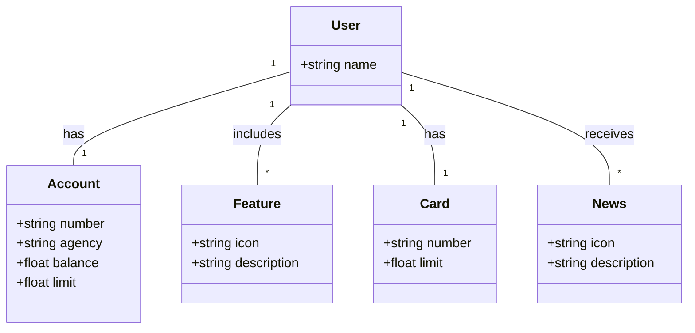

# Santander Dev Week - Estudo 
## Diagrama de Classes

```mermaid
classDiagram
    class User {
        +string name
    }

    class Account {
        +string number
        +string agency
        +float balance
        +float limit
    }

    class Feature {
        +string icon
        +string description
    }

    class Card {
        +string number
        +float limit
    }

    class News {
        +string icon
        +string description
    }

    User "1" -- "1" Account : has
    User "1" -- "*" Feature : includes
    User "1" -- "1" Card : has
    User "1" -- "*" News : receives
```
